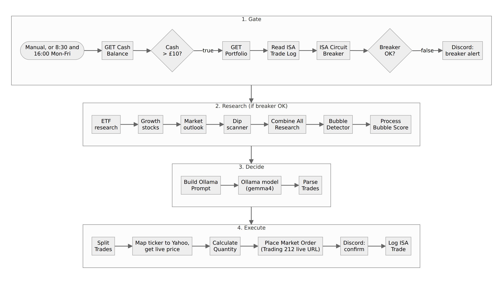

# n8n-trading-bots-clean

Four exported n8n workflows that had a local LLM pick and place Trading 212 trades, scrubbed of credentials and shared as a reference for n8n builders. They are not a working or profitable strategy.



*The node flow of `Trading212_AI_Autonomous_Trader_v2_CLEAN.json`, grouped into four stages. Node names and order come from the export's own `connections` block.*

  

## Status: read this first

**These workflows did not work, and they have been retired.** On the Trading 212 demo account they ran against, the account showed a realised loss of **£424** (measured 14 July 2026). Review at the time found the swing bot's sells were broken, so positions were never exited. The flows were removed from service in August 2026 and replaced by a separate, deterministic system that is not in this repo.

- Nothing in this repo measures performance. There is no backtest, no trade log and no results file.
- Workflow names such as "£20/day target" describe what the bot was **meant** to do, not what it did.
- **This is not financial advice.** Use it to learn how n8n nodes fit together, not as a strategy.

## What it does

The repo holds four n8n workflow exports (uploaded May 2026):

| File | What the workflow does | Nodes |
|---|---|---|
| `Trading212_AI_Autonomous_Trader_v2_CLEAN.json` | The "ISA buy bot". Twice each weekday, checks cash and a circuit breaker, crawls ETF and stock pages, asks a local Ollama model for trades, sizes them from a Yahoo price, places market orders and logs them to CSV. | 31 |
| `Swing_Bot_v2___T212_Demo___20_day_target__CLEAN.json` | Hourly swing trader, 9:00 to 15:00 on weekdays. Scores dips from Yahoo price history, checks news sentiment, asks the model which positions to sell, plus daily and weekly Discord reports and a nightly Unsloth fine-tune step. | 50 |
| `Global_Market_Picker_CLEAN.json` | Scans Yahoo Finance RSS (US, UK, Europe and Asia, catalysts) and CoinGecko at 8:00, 12:00 and 16:00 on weekdays, has the model summarise, then posts to Discord and sends an email. Places no trades. | 14 |
| `Del-Boy_Trading_Morning_Brief_v2_CLEAN.json` | At 7:55 on weekdays, reads positions and the account summary, pulls Yahoo news, asks an OpenAI-compatible model endpoint for a morning brief and posts it to a Discord webhook. Places no trades. | 9 |

## Quick start

You need n8n, an Ollama server, and Trading 212 API credentials. Use the **demo** account only.

1. Clone the repo:
   ```bash
   git clone https://github.com/casareanderson/n8n-trading-bots-clean.git
   ```
2. In n8n, **Workflows > Import from File** and pick one JSON file.
3. Create your own credentials. Every credential in the exports is replaced with `REDACTED_CRED_NAME`, and the Discord webhook with `YOUR_WEBHOOK_ID/YOUR_WEBHOOK_TOKEN`.
4. **Check every URL before you activate anything** (see the limits below). Several nodes point at `live.trading212.com`.

Success looks like the workflow opening in the editor with every node present and credential warnings on the nodes that need your keys.

## Usage

Run a workflow by hand first with its manual or schedule trigger, and watch each node's output in the n8n editor. The schedules in the exports are:

| Workflow | Schedule (cron) |
|---|---|
| Autonomous Trader v2 | `30 8 * * 1-5`, `0 16 * * 1-5` |
| Swing Bot v2 | hourly `0 9-15 * * 1-5`, report `0 16 * * 1-5`, weekly `0 17 * * 5`, instruments `0 8 * * 1-5`, fine-tune 01:00 daily |
| Global Market Picker | `0 8,12,16 * * 1-5` |
| Del-Boy Morning Brief | `55 7 * * 1-5` |

## Configuration

| What | Where | Notes |
|---|---|---|
| Trading 212 credentials | HTTP Request nodes | Redacted. Add your own Basic auth credential. |
| Ollama model | "Message a model" nodes | Set to `gemma4:latest` in all three Ollama workflows |
| Model endpoint (Del-Boy) | "Ask Gemma - Unsloth" | An OpenAI-compatible `/v1/chat/completions` URL on a local network. Point it at your own, e.g. `http://192.0.2.10:8890`. |
| Crawler (Autonomous Trader) | the four "Tavily" nodes | Despite the names, they POST to a crawl4ai service at `http://localhost:11235/crawl` |
| Trade logs | Execute Command nodes | CSV and JSONL files on a mounted share under the original host's home folder. Change the paths. |
| Discord | Discord nodes and the Del-Boy webhook | Redacted |

## How it works

All four are ordinary n8n workflows: schedule triggers, HTTP Request nodes for Trading 212, Yahoo and CoinGecko, Code nodes in JavaScript for scoring and sizing, an Ollama node for the decision, Discord nodes for alerts, and Execute Command nodes that read and append to local CSV logs. The diagram at the top shows the Autonomous Trader. The Swing Bot follows the same shape with a sell loop added.

```
.
├── Trading212_AI_Autonomous_Trader_v2_CLEAN.json        # buy bot, 31 nodes
├── Swing_Bot_v2___T212_Demo___20_day_target__CLEAN.json # swing bot, 50 nodes
├── Global_Market_Picker_CLEAN.json                      # scan + Discord/email, 14 nodes
├── Del-Boy_Trading_Morning_Brief_v2_CLEAN.json          # morning brief, 9 nodes
└── docs/isa-trader-flow.png                             # the diagram above
```

## Limits and known faults

Found by reading the exports on 8 October 2026:

- **The "Demo" swing bot trades live.** Despite its name, its cash, portfolio and market-order nodes call `live.trading212.com`. Only its instrument list comes from the demo host. The Autonomous Trader and Morning Brief also use the live host.
- **The swing bot's sell cannot work as written.** "Execute Sell" sends `DELETE` to `/equity/portfolio/{ticker}`. Trading 212's public API sells by placing a market order with a negative quantity, so this node is the likely reason positions were never exited.
- **The Del-Boy file is not valid JSON.** The scrub cut off the Discord webhook URL line (line 148 has no closing quote and comma). Python's `json` module rejects the file, so expect an n8n import to fail until you repair that line.
- **An LLM decides what to buy and sell.** The model's reply is parsed and turned straight into orders. That is the design flaw behind the loss above.
- **Loose ends.** In the Autonomous Trader, "Discord: Notify Trades" has no input. In the Swing Bot, "Unsloth Setup" and "Nightly Unsloth Fine-tune" are not connected to anything, so the fine-tune never ran from this flow.
- **Market orders only**, sized from a Yahoo price, with no stop orders placed on the broker.

## Licence and credits

MIT, see [LICENSE](LICENSE). Built on [n8n](https://n8n.io/) (Sustainable Use Licence) and [Ollama](https://ollama.com/). Market data comes from Yahoo Finance and CoinGecko, and the brokerage is Trading 212; each has its own terms of use.
